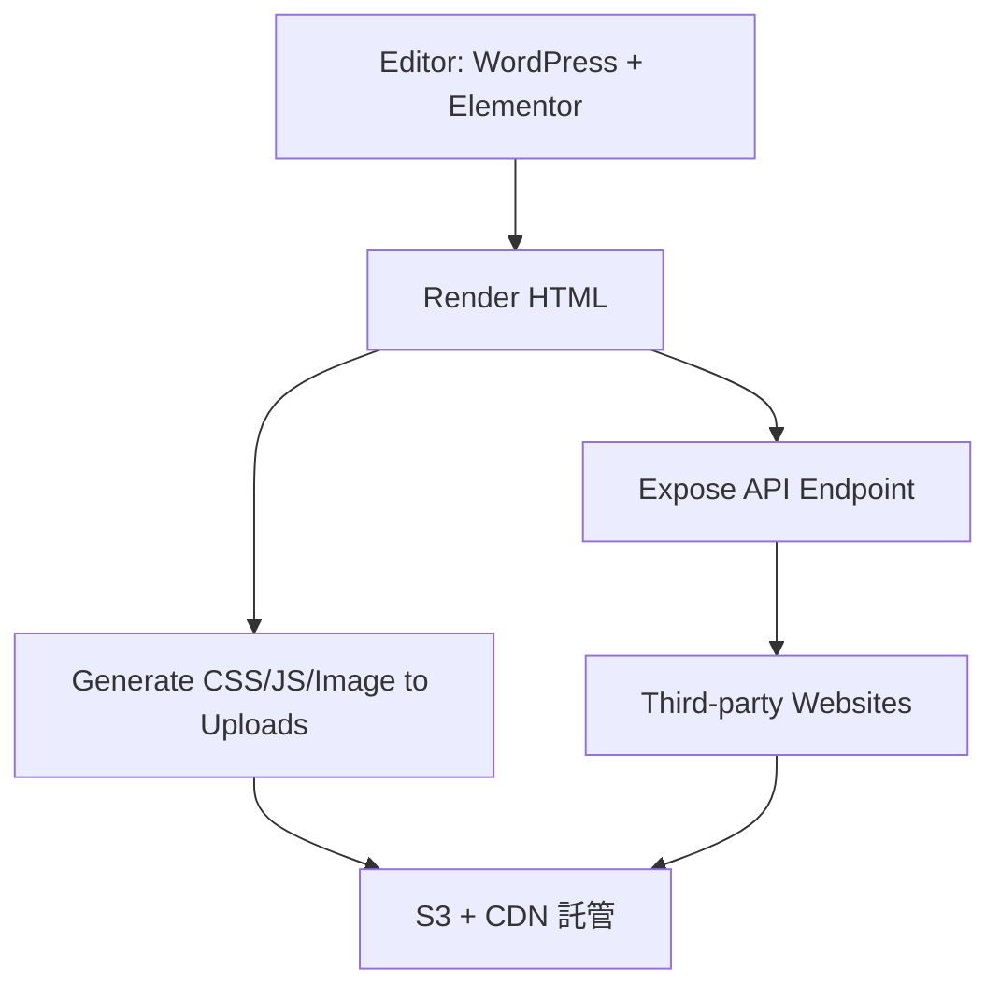
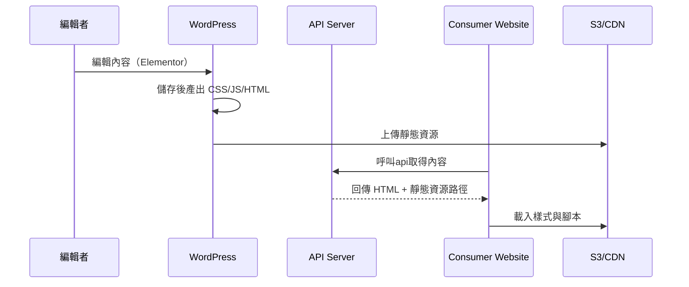
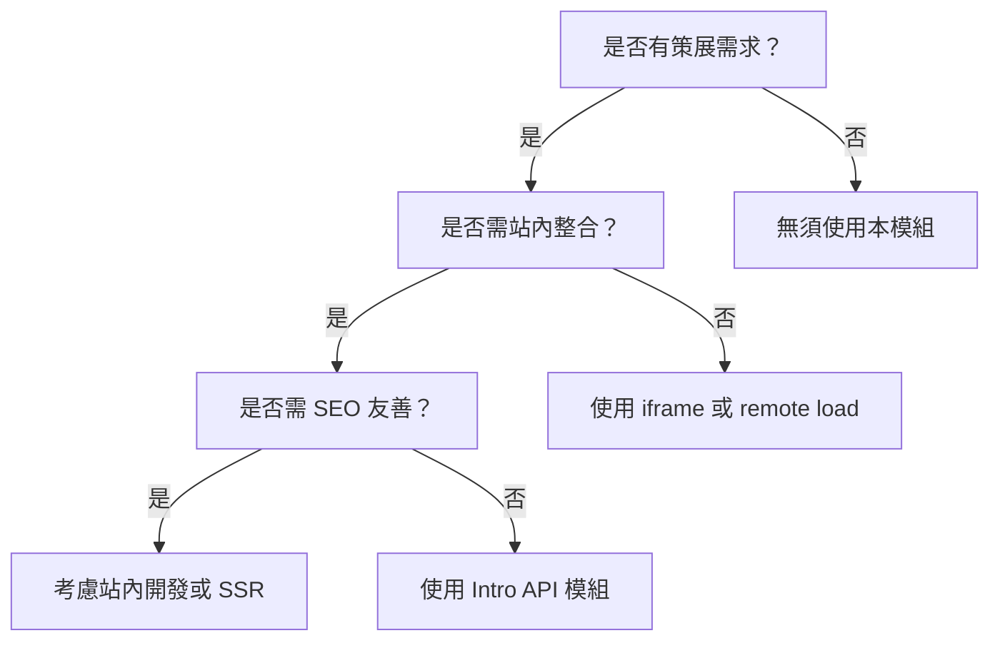

title: 用 WordPress + Elementor 打造可嵌入內容模組 API
description: 工程團隊簡報 | 產品架構與實作分享

---

# 🎯 目標與產品定位

## 問題

- 內容需頻繁更新、多人協作、跨站共用
- 第三方網站需嵌入一致且即時內容
- 過去靠複製貼上、人為維護 → 容易錯漏

--- 
演化

---

## 解法

- 建立一套 **集中式內容編輯 + 分散式內容嵌入** 的架構

---

# 🧱 系統總覽架構圖

---

# 🔁 內容渲染流程

---

# 📈 策展頁面應用與取捨流程

---

# 🧪 技術挑戰與解法

| 問題 | 解法 |
|------|------|
| Elementor 僅支援完整頁渲染 | 使用內部函式渲染指定 post |
| 靜態資源不公開 | 搭配 WP Offload Media or 手動部署 S3 |
| 樣式衝突 | 使用 Shadow DOM / inline style 注入 |
| 動態效果依賴 JS | 需標準化並加載必要資源 |

---

# 🌐 嵌入方式應用場景

- 第三方網站直接 JS 嵌入
- iframe 封裝（保障樣式獨立）
- Server-side render 內容（如：Nuxt、Next）

---

# 📊 表格特性比較

| 模式 | 免上線調整 | 站內呈現(SEO) | 客製化彈性 | 產品工程開發成本 |
|------|--------------|------------------|--------------|------------------------|
| 站內開發 | ❌ | ✅ | 最高 | 高 |
| CMS (原 WordPress) | ✅ | ❌ | 中 | 無 |
| Intro (本功能) | ✅ | ✅ | 中低 | 無 |

---

# 🔍 使用方注意流程（建議）

1. **確認用途：** 是否為活動頁、廣告、教學、推薦等模組
2. **設計支援尺寸與容器類型：** 確保內容可被嵌入多種裝置與版面
3. **CSS/JS 引用完整性確認：** 須加載 API 回傳對應靜態資源
4. **內容更新後 CDN 快取注意事項：** 更新頻率高者可加 Cache-Buster 機制
5. **若需與頁面互動，建議額外初始化 hook 規範**

---
